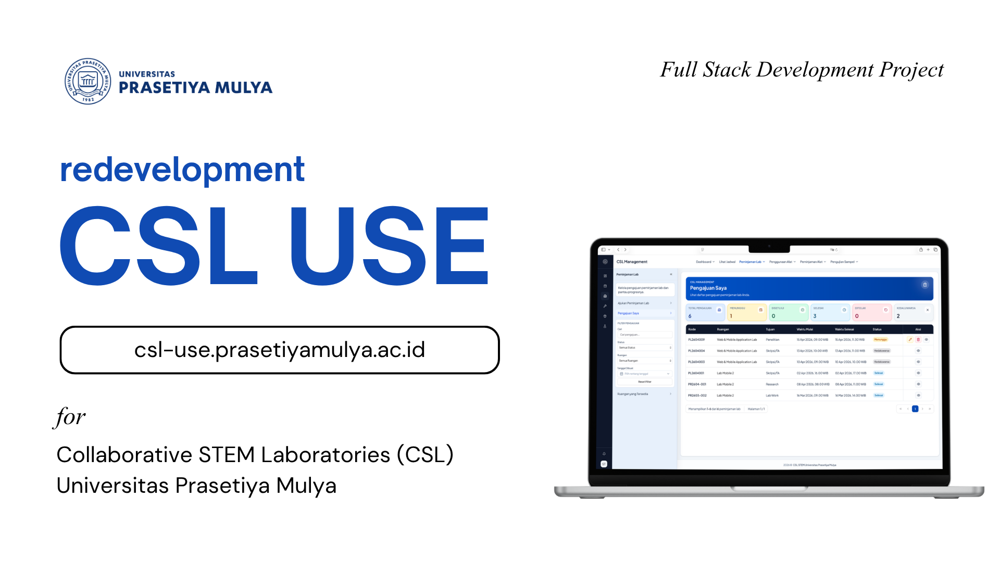

# CSL USE 🚀

CSLUSE adalah aplikasi internal untuk pengelolaan operasional laboratorium, mencakup autentikasi pengguna, dashboard, booking ruangan, peminjaman alat, sample testing, approval workflow, dan area admin.

Dibuat untuk Collaborative STEM Laboratories (CSL)Universitas Prasetiya Mulya

## ✨ Fitur Utama

- 🔐 Autentikasi dan otorisasi pengguna
- 📊 Dashboard operasional pengguna
- 🏢 Peminjaman ruangan
- 🧰 Peminjaman alat
- 🧪 Pengujian sampel
- 🗂️ Surat bebas laboratorium
- ✅ Approval dan review workflow
- 🗂️ Admin management untuk inventory, history, task, dan user

## 🛠️ Tech Stack

- Backend: Django 4.2, Django REST Framework, Python 3.12
- Frontend: React 19, Vite, TypeScript
- Database: PostgreSQL 13
- Deployment: Docker Compose + Nginx

## 📁 Struktur Project

```text
.
├── backend/          # Django API
├── frontend-react/   # React app
├── infra/            # Konfigurasi infrastruktur
├── docker-compose.yml
├── docker-compose.prod.yml
└── Makefile
```
